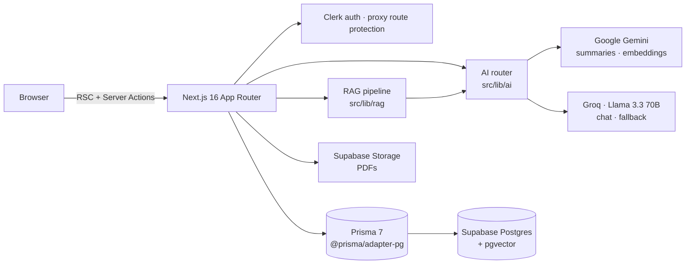

# StudyMind

> An AI-powered study companion that helps students learn faster and remember longer.

Upload your study materials (PDFs or notes) and StudyMind turns them into
**summaries**, **cited answers** (RAG chat), **quizzes**, **spaced-repetition
flashcards**, and **mind maps** — then keeps you on track with a **planner**,
**Pomodoro**, **goals/streaks**, and a **progress dashboard**.

Built as a full-stack + AI engineering portfolio project.

<!-- Add a screenshot or GIF demo here -->
<!--  -->

**Live demo:** _add your Vercel URL_

---

## ✨ Features

| Area | What it does |
| ---- | ------------ |
| **Documents** | Drag-and-drop PDF upload or paste text; server-side extraction; list/detail; rename/delete |
| **AI Summaries** | Structured TL;DR + key points + section breakdown (regenerate) |
| **RAG Chat** | Streaming answers grounded in your documents, with **page-level citations**; multi-document context |
| **Quizzes** | MCQ / true-false / short-answer at Easy/Medium/Hard; auto-grading; attempts saved |
| **Flashcards** | AI-generated decks; flip study mode; **SM-2 spaced repetition** with due-today queues |
| **Mind Maps** | Hierarchical concept extraction rendered as an interactive, pannable graph with expand/collapse |
| **Planner** | Tasks (list + month calendar), Pomodoro with session logging, goals + streak heatmap, reminders |
| **Progress** | Study-time/accuracy charts, subject breakdown, automatic **weakness detection** |
| **Export & Share** | Export to PDF / Markdown / Anki CSV; read-only public share links for quizzes & decks |
| **Leaderboard** | Opt-in XP ranking (quizzes + reviews + streaks), privacy-first |
| **Accounts** | Clerk auth (email/password + Google + GitHub), profile, achievement badges, settings |

**Roadmap:** full multi-language UI (i18n scaffolding is in place), drag-to-reschedule
in the planner, mind-map image export, and native mobile apps.

---

## 🧠 Engineering highlights

### Multi-provider AI architecture with automatic fallback

A small, provider-agnostic interface (`src/lib/ai`) — `generate`, `generateJSON`,
`chatStream`, `embed` — sits in front of swappable providers, with a router that
**falls back automatically** on rate-limit/transient errors:

| Operation | Primary | Fallback |
| --------- | ------- | -------- |
| `generate` / `generateJSON` | Gemini | Groq |
| `chatStream` | Groq (fast) | Gemini (only if nothing emitted yet) |
| `embed` | Gemini | — |

This keeps the app working even when one provider is unavailable, and isolates
provider details from every feature. `generateJSON` enforces strict JSON for
structured outputs (quizzes, flashcards, mind maps) with fence-stripping and a
retry.

### From-scratch RAG pipeline (no LangChain)

`src/lib/rag` implements retrieval-augmented generation end to end:

```
chunk (token-aware + overlap, page-tracked)
  → embed (Gemini, 768-dim)
  → store in Supabase pgvector
  → on query: embed question → cosine top-k (HNSW index) → assemble context
  → answer (streamed) with page-level citations
```

Pure pieces (`chunk`, `context`) are unit-tested; retrieval uses pgvector's
`<=>` operator via raw SQL through Prisma.

---

## 🏗️ Architecture



- **Next.js 16 App Router** (React 19, Server Components + Server Actions).
- All AI/secret calls run **server-side only** — keys never reach the client.
- **Clerk** handles auth; route protection lives in `src/proxy.ts` (Next 16
  renamed Middleware → Proxy).
- **Prisma 7** with the `@prisma/adapter-pg` driver adapter talks to **Supabase
  Postgres + pgvector**; files live in **Supabase Storage**.

---

## 🧰 Tech stack

Next.js 16 · TypeScript · Tailwind CSS v4 · shadcn/ui · Framer Motion ·
next-themes · Clerk · Supabase (Postgres + pgvector) · Prisma 7 ·
Google Gemini · Groq (Llama 3.3 70B) · @xyflow/react · Recharts · unpdf · jsPDF ·
date-fns · deployed on Vercel.

---

## 🚀 Getting started

```bash
git clone <your-repo-url>
cd StudyMind
npm install                 # also runs `prisma generate`
cp .env.example .env.local  # fill in your keys (see below)
npm run db:deploy           # apply migrations to your database
npm run dev                 # http://localhost:3000
```

### Environment variables

See [`.env.example`](./.env.example). You'll need:

- **Clerk** — `NEXT_PUBLIC_CLERK_PUBLISHABLE_KEY`, `CLERK_SECRET_KEY`
  (enable Google + GitHub in the Clerk dashboard).
- **AI** — `GEMINI_API_KEY` ([aistudio.google.com](https://aistudio.google.com/apikey)),
  `GROQ_API_KEY` ([console.groq.com](https://console.groq.com/keys)).
- **Supabase** — `NEXT_PUBLIC_SUPABASE_URL`, `NEXT_PUBLIC_SUPABASE_ANON_KEY`,
  `SUPABASE_SERVICE_ROLE_KEY`, plus `DATABASE_URL` (transaction pooler) and
  `DIRECT_URL` (session pooler, for migrations). Enable the `vector` extension.

### Scripts

| Script | Purpose |
| ------ | ------- |
| `npm run dev` | Start the dev server |
| `npm run build` / `start` | Production build / serve |
| `npm run lint` | ESLint |
| `npm run db:migrate` | Create a dev migration |
| `npm run db:deploy` | Apply migrations |
| `npm run db:studio` | Prisma Studio |

---

## 📁 Project structure

```
src/
  app/
    (marketing)/        landing, pricing, about, privacy, terms
    (auth)/             Clerk sign-in / sign-up
    (app)/              authenticated shell (sidebar + topbar)
    share/[token]/      public read-only shared views
    api/chat/           streaming RAG chat endpoint
  components/           UI (shadcn), layout, and per-feature components
  lib/
    ai/                 multi-provider AI layer + router
    rag/                from-scratch RAG (chunk, embed, retrieve, context)
    documents/ quiz/ flashcards/ mindmap/ ...  feature logic
  generated/prisma/     generated Prisma client (gitignored)
prisma/                 schema + migrations
```

---

## ☁️ Deployment (Vercel)

1. Push this repo to GitHub and import it in Vercel.
2. Add every variable from `.env.example` in **Project Settings → Environment
   Variables** (use the same Supabase project; `DATABASE_URL` = transaction
   pooler, `DIRECT_URL` = session pooler).
3. Apply migrations to the production database: `npm run db:deploy` (locally,
   pointed at the prod `DIRECT_URL`, or as a one-off).
4. Deploy. `prisma generate` runs automatically on install; the build is the
   standard `next build`.

---

## License

Personal portfolio project.
